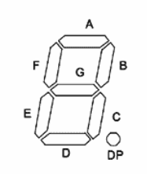
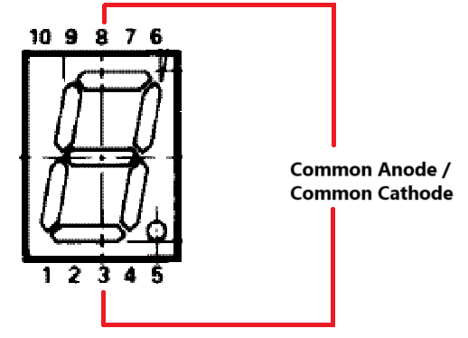

# 7-Segment Display Library for STM32

A library to control a 7-segment display on STM32 boards.

The library has been tested using a STM32F401RE board using a common-anode 7-segment display (Model: 5611-BSR).

## Basic Usage

See `./Core/Src/main.c` for example code. 

The following functions are available for controlling the LED's.
The LED segments follow naming according to the [schematics section](#schematics).

```c
// Set a single or multiple LED segments to a specific state without affecting other segments
// LED is ON if `state` is any non zero value, else OFF
void SevenSegmentDisplay_set_leds(SevenSegmentDisplay* display, SevenSegmentDisplay_LED_flags leds, int state);

// Example: Turn ON segments A and F, then OFF
SevenSegmentDisplay_LED_flags flags = (SevenSegmentDisplay_FLAG_A | SevenSegmentDisplay_FLAG_F);
SevenSegmentDisplay_set_leds(&display, flags, SevenSegmentDisplay_LED_HIGH);
SevenSegmentDisplay_set_leds(&display, flags, SevenSegmentDisplay_LED_LOW);

// Display a digit from 0-9
void SevenSegmentDisplay_show_digit(SevenSegmentDisplay* display, uint8_t digit);

// Example: Display digit 5
SevenSegmentDisplay_show_digit(&display, 5);

// Turn ON LEDs set in `leds` and turn others OFF
void SevenSegmentDisplay_show_leds(SevenSegmentDisplay* display, SevenSegmentDisplay_LED_flags leds);

// Example: Turn ON only G and decimal-point (DP) LED segments
SevenSegmentDisplay_show_leds(&display, (SevenSegmentDisplay_FLAG_G | SevenSegmentDisplay_FLAG_DP));
```

**Note**: Both common-anode and common-cathode use `SevenSegmentDisplay_LED_LOW` for turning OFF the LED segments and `SevenSegmentDisplay_LED_HIGH` for turning ON the LED segments.

## Schematics

### Display Segments 



### Pinout



## References
https://www.nikom.biz/pdf/LED5611-BSR.pdf  
https://www.farnell.com/datasheets/2095789.pdf